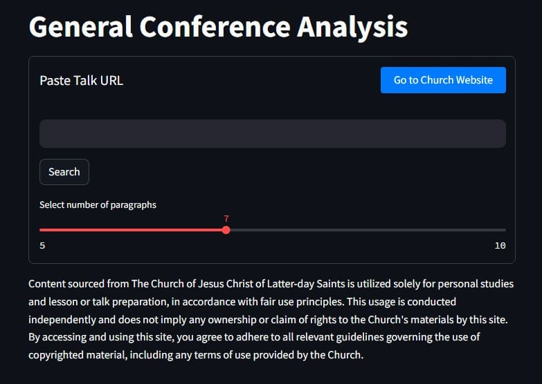
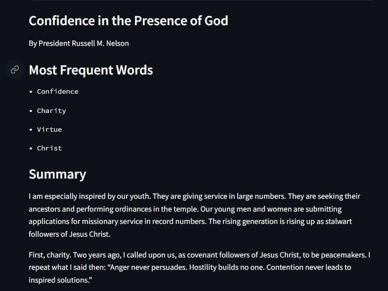
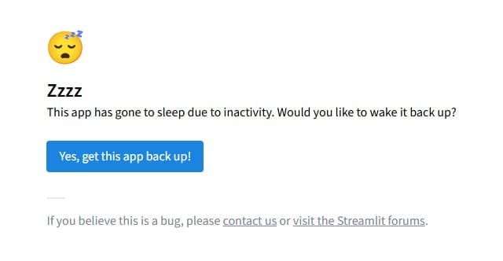

# General Conference Talk Analyzer

This is a personal NLP project I built to convert LDS General Conference talks into engaging, tailored lessons for Sunday study or quick personal reflection.

## Motivation

I once had an Elder's Quorum President who would lead lessons by simply popcorn-reading conference talks. who led lessons by popcorn-reading conference talks until someone in the back row fell asleep. (That someone was me—more than once.) So I built this tool out of self-defense.

Now, instead of dozing off mid-sentence, I use this app every Sunday to break down General Conference talks into bite-sized insights, clear summaries, and core themes. 

## UI of the Streamlit Site

## Features

- 📝 **Text Preprocessing**  
  - Paragraph segmentation  
  - Lemmatization and stopword removal

- 📊 **TF-IDF Sentence Ranking**  
  - Ranks sentences by importance within each paragraph  
  - Highlights key ideas and concepts

- 🧠 **Theme Extraction**  
  - Uses TF-IDF keywords to derive core sermon themes

- 📚 **Automatic Summarization**  
  - Delivers a concise, readable summary of any General Conference talk

- 🎛️ **Streamlit UI**  
  - Easy-to-use web interface  
  - Select talks, view summaries, and prepare lessons on the fly

## How It Works

1. Paste a General Conference talk URL.
2. The NLP pipeline processes and cleans the text.
3. TF-IDF analysis identifies the most important words and sentences.
4. Summary and themes are generated and displayed in a user-friendly format.

## Tech Stack

- **Python**
- **Streamlit** – for the web interface
- **NLTK** – for text processing
- **scikit-learn** – for TF-IDF and vectorization

## Use Cases

- Sunday lesson prep  
- Personal study  
- Youth or Gospel Doctrine teaching aids  
- Quick theme analysis for any talk

## Example Output of a Conference Talk

## Try it Out

https://generalconferenceanalysis.streamlit.app/

You may have to wake it up. It should take less than a minute but sometimes takes a little longer. Just be patient and refresh if needed. 

